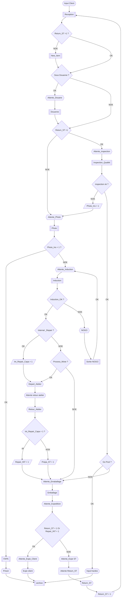

# Flux de Processus – Raspi Stock V2

## Diagramme du Workflow



## Statuts validés

```
Attente Douane
Attente Photo
Attente Inspection
Attente Induction
NOGO
Depart Atelier
Attente Emballage
Attente Expedition
Attente Expe Client
Attente Expe ST
Retour Atelier
Prison
Disponible
Exp ST Return
ARCHIVE
STOCK
```

---

## Étapes du Processus

### 1️⃣ **Réception** → Point d'entrée (`/work/reception`)
- **Deux modes de traitement** :
  - **Nouvel article** (return_st = 0) : Création d'un nouvel item
  - **Retour ST** (return_st = 1) : Récupération d'un article existant par SKU
- **Routing automatique** :
  - Return ST → Attente Douane (si sous_douane=1) ou Attente Inspection
  - Nouvel article → Attente Douane (si sous_douane=1) ou Attente Photo
- **Rôle** : `reception`, `admin`
- **Point d'entrée direct** : Traitement immédiat sans encours

### 2️⃣ **Contrôle Douane** → (`/work/douane`)
- **Entrée**: `Attente Douane`
- **Décisions TL1 (Return_ST = 1 ?)**:
  - ✅ **OK** → Si return_st = 1 → `Attente Inspection`, sinon → `Attente Photo`
  - ❌ **NOK** → Si sous_douane = 1 → `Attente Réparation`, sinon → `Attente Emballage`
- **Rôle**: `douane`, `admin`

### 3️⃣ **Poste Photo** → (`/work/photo`)
- **Entrée**: `Attente Photo`
- **Décisions TL3 (Photo_Ins = 1 ?)**:
  - ✅ **OK** → Si photo_ins = 1 → `Attente SAP`, sinon → `Attente Kardex`
- **Rôle**: `photo`, `admin`

### 3.5️⃣ **Attente SAP** → (`/work/sap`)
- **Entrée**: `Attente SAP`
- **Action**: ✅ Création Avis SAP → `Disponible`
- **Rôle**: `admin`, `reception`

### 4️⃣ **Inspection** → (`/work/inspection`)
- **Entrée**: `Attente Inspection`
- **Décisions TL4 (Int_Repair_Capa = 1 ?)**:
  - ✅ **OK** → Si int_repair_capa = 1 → `Attente Réparation`, sinon → `Attente Emballage`
  - ❌ **NOK** → `Attente Emballage`
- **Rôle**: `inspection`, `admin`

### 5️⃣ **Kardex** → (`/work/kardex`)
- **Entrée**: `Attente Kardex`
- **Décisions TL6 (Prepa_ST = 1 ?)**:
  - ✅ **OK** → Si prepa_st = 1 → `Attente Prison`, sinon → `Attente Pool`
- **Rôle**: `kardex`, `admin`

### 5.5️⃣ **Attente Pool** → (`/work/pool`)
- **Entrée**: `Attente Pool`
- **Action**: ✅ Mise en stock Pool → `Disponible`
- **Rôle**: `admin`, `inspection`

### 5.6️⃣ **Attente Prison** → (`/work/prison`)
- **Entrée**: `Attente Prison`
- **Décisions**:
  - 🗑 **Supprimer** → `NOGO` → **FIN**
  - 🔄 **Retry** → `Attente Inspection`
- **Rôle**: `admin`, `inspection`

### 6️⃣ **Emballage** → (`/work/emballage`)
- **Entrée**: `Attente Emballage`
- **Décisions TL7 (Repair_Int = 1 ?)**:
  - ✅ **OK** → Si repair_int = 1 → `Attente Réception`, sinon → `Attente Expédition`
- **🚫 NOGO** → `Exp ST Return` → **FIN**
- **Rôle**: `emballage`, `admin`

### 7️⃣ **Réparation** → (`/work/repair`)
- **Entrée**: `Attente Réparation`
- **Action**: ✅ OK → `Attente Emballage`
- **🚫 NOGO** → `Exp ST Return` → **FIN**
- **Rôle**: `admin`

### 8️⃣ **Expédition** → (`/work/expe`)
- **Entrée**: `Attente Expédition`
- **Action**: ✅ Expédition → `ARCHIVE` → **FIN**
- **Rôle**: `expedition`, `admin`

### 9️⃣ **Réception Check** → (`/work/reception_check`)
- **Entrée**: `Attente Réception` (boucle depuis Emballage)
- **Décisions**:
  - ✅ **OK** → `Attente Photo`
  - ❌ **NOK** → Retour `Attente Réception`
- **Rôle**: `reception`, `admin`

---

## Flags et Décisions

- **Return_ST**: Détermine le chemin après Douane OK
- **Sous Douane**: Détermine le chemin après Douane NOK
- **Photo_Ins**: Ancien flag pour Photo (maintenant simplifié)
- **Int_Repair_Capa**: Détermine si réparation possible après Inspection
- **Repair_Int**: Détermine le chemin après Emballage
- **Prepa_ST**: Ancien flag pour Kardex (maintenant simplifié)

---

## Points de Terminaison

- **FIN**: Items archivés ou supprimés logiquement
- **Boucles**: Attente Réception peut boucler pour vérifications
- **SAP/Pool/Prison**: Références supprimées du workflow
- **Note**: Pool et Prison sont des décisions intégrées au processus d'Inspection, ce ne sont pas des étapes indépendantes avec leur propre plan de charge.

### 🔟 **Kardex & Expédition** → (`/work/kardex`)
- **Chemin 1: Kardex Input**
  - ✅ Échange Standard? → `Exp Externe` → **FIN**
  - ❌ → `Préparation ST`
  
- **Chemin 2: Préparation ST**
  - ✅ Prepa OK? → `Appel FO`
  - ❌ → `Kardex Output`
  
- **Chemin 3: Appel FO**
  - Complete → `Kardex Output`
  
- **Chemin 4: Kardex Output**
  - ✅ Finaliser → `STOCK` (archive, active=0) → **FIN**

- **Rôle**: `admin`

---

## Flags de Décision (Colonnes ajoutées)

```sql
is_nogo              -- Article NOGO (redirection exp ST)
is_repair_snpa       -- Article pour repair SNPA
pool_ok              -- Validation pool
std_exchange         -- Échange standard
prepa_st_ok          -- Préparation ST validée
```

---

## Pages de charge de travail

### Visualisation des charges
- `GET /workload/douane` - Charge Douane (rôles: `douane`, `admin`)
- `GET /workload/photo` - Charge Photo (rôles: `photo`, `admin`)
- `GET /workload/inspection` - Charge Inspection (rôles: `inspection`, `admin`)
- `GET /workload/rac` - Charge RAC (rôles: `rac`, `admin`)
- `GET /workload/emballage` - Charge Emballage (rôles: `emballage`, `admin`)
- `GET /workload/expe` - Charge Expédition (rôles: `expedition`, `admin`)
- `GET /workload/repair` - Charge Repair (rôles: `admin`)
- `GET /workload/kardex` - Charge Kardex (rôles: `admin`)
- `GET /workload/input_st` - Charge Input ST (rôles: `admin`)
- `GET /workload/nogo` - Charge NOGO (rôles: `admin`)

### Autres pages
- `GET /manager_dashboard` - Dashboard Manager (rôles: `manager`, `admin`)
- `GET /robot_status` - Statut Robot MiR (rôles: `admin`, `photo`, `inspection`, `emballage`)
- `GET /admin_users` - Gestion Utilisateurs (rôles: `admin`)
- `GET /archives` - Archives (rôles: `admin`, `emballage`, `inspection`)

---

## Structure de base de données

### Table `item` (colonnes clés)
```sql
id, sku, pn, description, photo_path, size, status,
active, st_repair, repair_snpa, hors_gabarit, location_id,
avis_no, order_no, bl_no, created_at, updated_at,
is_nogo, is_repair_snpa, 
pool_ok, std_exchange, prepa_st_ok
```

### Table `movement`
```sql
id, item_id, from_location_id, to_location_id, action, created_at, user
```

---

## Migration

La BD s'auto-initialise avec :
1. Création des tables si absentes
2. Ajout des colonnes manquantes (ALTER TABLE)
3. Migration forcée pour ancien schéma

---

## Notes

- **Suppressions logiques**: Les items finalisés gardent `active=0` et le statut `STOCK` ou `Supprimé`
- **Historique**: Tous les changements sont tracés dans la table `movement`
- **Part Number (PN)**: Champ textuel pour identifier les articles
- **Boucles**: Plusieurs niveaux de retry (photo RAC, prison, etc.)
- **État actuel**: Les routes de traitement (`/work/*`) retournent 404. L'application affiche désormais les charges de travail via les pages `/workload/*` pour visualisation uniquement.

---

**Dernière mise à jour**: 2026-03-23
